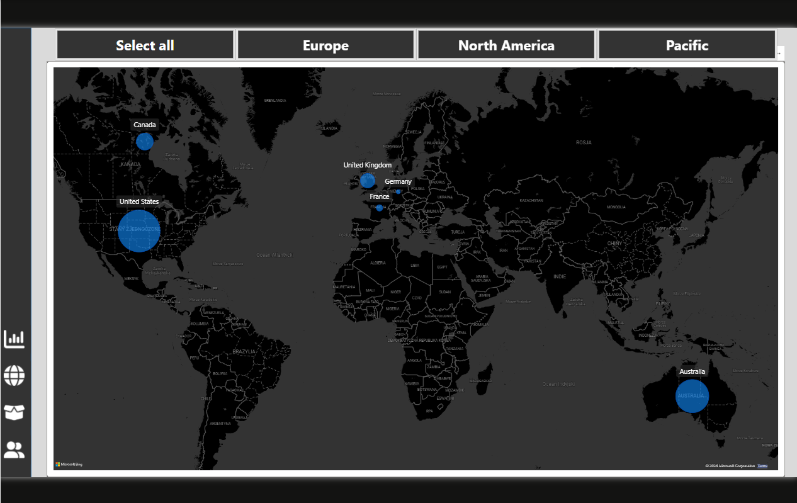

# 🚴 AdventureWorks Cycles – Power BI Business Intelligence Report

---

## 📸 Screenshots

### Exec Summary – KPI Overview


### Regional Performance Map


### Product Detail


### Customer Detail


---

## 🎯 Business Context

In this project I take on the role of a **Business Intelligence Analyst** at AdventureWorks Cycles – a fictional global manufacturer of bicycles and cycling accessories.

**The report is designed to answer four key business questions:**
- How is the business performing overall? *(Revenue, Profit, Orders, Returns)*
- Which regions are driving the most sales?
- Which products are best and worst performers?
- Who are the most valuable customers?

---

## 📊 Report Pages

### 1. 📈 Exec Summary
- KPI Cards: Total Revenue, Total Profit, Total Orders, Return Rate
- Monthly Revenue trending line chart
- Orders by Product Category (bar chart)
- Top 10 Products by Orders with Revenue and Return Rate
- Date range slicer

### 2. 🗺️ Regional Performance
- Bubble map: Total Orders by region
- Continent slicer
- Revenue breakdown by country

### 3. 🛍️ Product Detail
- Gauge charts: Monthly Orders vs Target, Revenue vs Target, Profit vs Target
- What-If price adjustment parameter with impact on profit
- Profit vs Adjusted Profit comparison line chart
- Metric selector slicer

### 4. 👤 Customer Detail
- KPI Cards: Total Customers, Revenue per Customer
- Line chart: Customer count over time
- Donut charts: Orders by Income Level, Orders by Occupation
- Top 100 Customers table with drillthrough

---

## 🔢 Key DAX Measures

```dax
-- Total Revenue
Total Revenue =
SUMX(
    Sales_Data,
    Sales_Data[OrderQuantity] * RELATED(Product_Lookup[ProductPrice])
)

-- Total Profit
Total Profit =
[Total Revenue] - [Total Cost]

-- Return Rate
Return Rate =
DIVIDE(
    [Total Returns],
    [Total Orders],
    0
)

-- Revenue Target (previous month +10%)
Revenue Target =
[Previous Month Revenue] * 1.10

-- YTD Revenue
YTD Revenue =
CALCULATE(
    [Total Revenue],
    DATESYTD('Calendar_Lookup'[Date])
)

-- 90-Day Rolling Revenue
90-Day Rolling Revenue =
CALCULATE(
    [Total Revenue],
    DATESINPERIOD(
        'Calendar_Lookup'[Date],
        LASTDATE('Calendar_Lookup'[Date]),
        -90,
        DAY
    )
)

-- Previous Month Revenue
Previous Month Revenue =
CALCULATE(
    [Total Revenue],
    DATEADD('Calendar_Lookup'[Date], -1, MONTH)
)
```

---

## 🗄️ Data Model

```
                    DIMENSION TABLES                        FACT TABLES
 
Calendar_Lookup ──────────────────────────────┬──────────► Sales_Data
(Date, Year, Month, Quarter, Weekend)         │            (OrderNumber, OrderDate,
                                               │             CustomerKey, ProductKey,
                                               └──────────► Returns_Data
                                                            (ReturnDate, ProductKey,
Customer_Lookup ──────────────────────────────────────────► Sales_Data        TerritoryKey, Quantity)
(CustomerKey, Name, Income Level, Occupation)
 
 
Product_Lookup ───────────────────────────────┬──────────► Sales_Data
(ProductKey, ProductName, Price, Cost)        │
       │                                       └──────────► Returns_Data
Product_Subcategories
(SubcategoryKey, SubcategoryName)
       │
Product_Categories
(CategoryKey, CategoryName)
 
 
Territory_Lookup ─────────────────────────────┬──────────► Sales_Data
(TerritoryKey, Region, Country, Continent)    │
                                               └──────────► Returns_Data
```
**Model type:** Fact Constellation Schema 
**Relationships:** One-to-many, single filter direction  
**Date table:** Custom Calendar table built with DAX `CALENDAR()` function

---

## 🧹 Data Preparation (Power Query)

- [x] Connected to multiple CSV source files
- [x] Promoted headers and removed blank rows
- [x] Changed data types with `en-US` locale (decimal separator)
- [x] Added conditional columns (e.g. SKU Type, Price Point)
- [x] Replaced null and zero values
- [x] Merged Product Subcategories into Product Lookup
- [x] Built Calendar dimension table in DAX
- [x] Disabled auto date/time and auto-detect relationships

---

## ✨ Key Features Implemented

| Feature | Description |
|---|---|
| **What-If Parameter** | Price adjustment slider dynamically recalculates profit |
| **Bookmarks** | Slicer panel show/hide toggle for clean UI |
| **Drillthrough** | Navigate from summary to product/customer detail pages |
| **Custom Tooltips** | Hover over data points for additional context |
| **Dynamic Titles** | Report titles update based on active filter selection |
| **Conditional Formatting** | Color scales and data bars on KPI tables |
| **Decomposition Tree** | AI visual for root cause exploration |
| **Key Influencers** | AI visual identifying drivers of key metrics |
| **Q&A Visual** | Natural language query interface |
| **Report Navigation** | Custom buttons for seamless page navigation |
| **Smart Narrative** | Auto-generated text summaries of key insights |

---

## 🛠️ Skills Demonstrated

`Power BI Desktop` `Power Query (M)` `DAX` `Data Modeling` `Star Schema` `Time Intelligence` `What-If Parameters` `Bookmarks` `Drillthrough` `Custom Tooltips` `Report Design` `KPI Dashboards` `AI Visuals` `Data Visualization Best Practices`

---

## 📁 Repository Structure

```
📦 powerbi-adventureworks
 ┣ 🖼️ Exec Dashboard.png
 ┣ 🖼️ Map.png
 ┣ 🖼️ Product Detail.png
 ┣ 🖼️ Customer Detail.png
 ┣ 📊 AdventureWorks_Report.pbix
 ┗ 📄 README.md
```

---

## 🚀 How to Open

1. Download `AdventureWorks_Report.pbix`
2. Open with **Power BI Desktop** (free download from [Microsoft](https://powerbi.microsoft.com/desktop/))
3. Data is embedded in the file – the report loads immediately with no additional setup required

---

## 📚 Course Reference

This project was built by following the Udemy course:

**[Microsoft Power BI Desktop for Business Intelligence](https://www.udemy.com/course/microsoft-power-bi-up-running-with-power-bi-desktop/)**  
by **Maven Analytics** | Instructor: Chris Dutton |

---

## 👤 Author

[LinkedIn](https://www.linkedin.com/in/damian-brz%C4%99k-84a368235/) · [GitHub](https://github.com/dbrzek)
